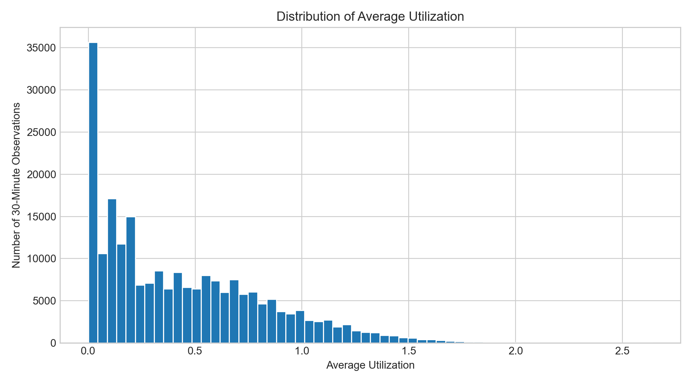
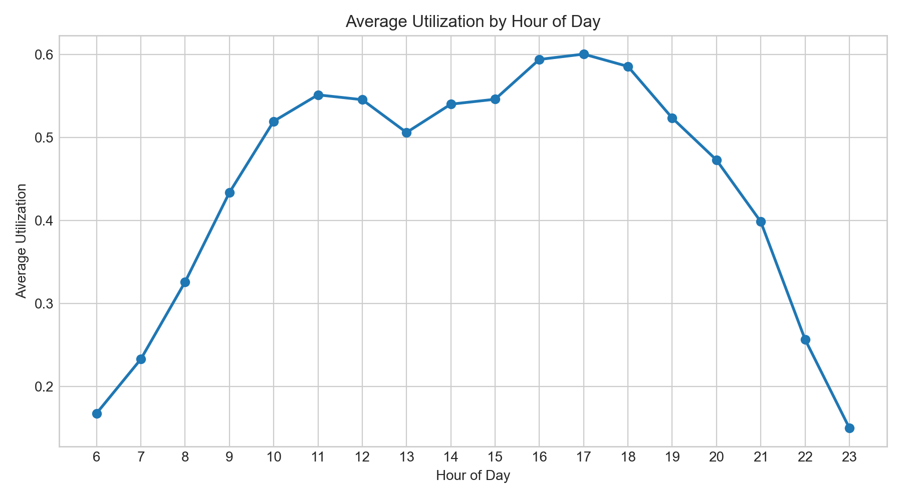
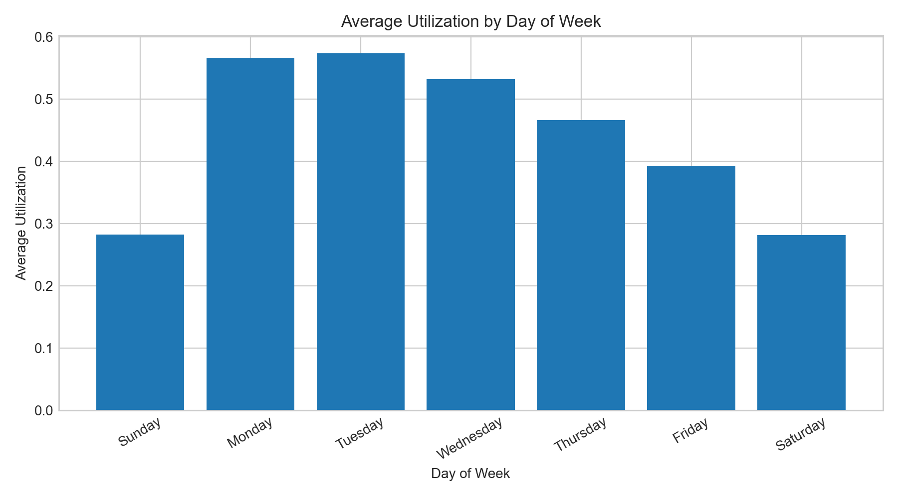
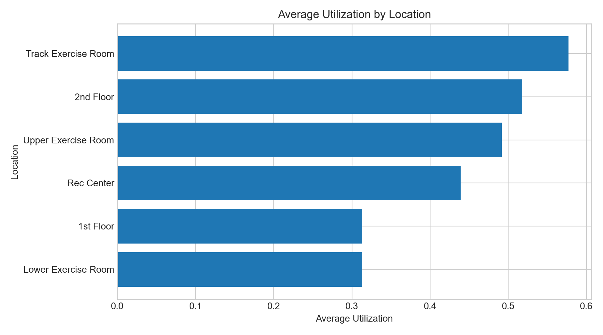
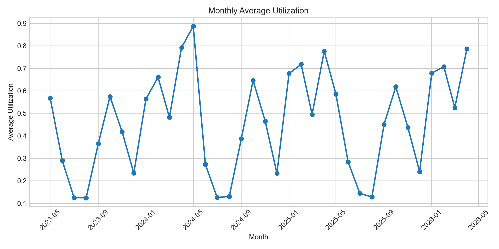
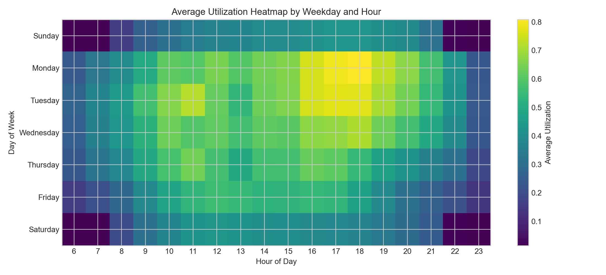

# Cal Poly Rec Center Usage Prediction Model

## Abstract

The Cal Poly Recreation Center is an important student resource, but students often have to guess when the facility or a specific workout area will be crowded. This project proposes a machine learning model that predicts Rec Center availability using historical Occuspace occupancy data collected in 30-minute intervals. The model will use date, time, day of week, location, capacity, and past usage patterns to estimate how busy the Rec Center will be at a given time.

The main prediction target will be `Average Utilization`, which measures occupancy relative to capacity. This target is useful because different Rec Center spaces have different capacities, so utilization gives a more comparable measure of crowding than raw occupancy alone. A secondary version of the project may convert utilization into low, medium, and high usage categories to make predictions easier for students to interpret.

## Type Of Project And Problem Definition

This project is primarily a supervised regression problem. The goal is to predict average utilization for a Rec Center location during a future 30-minute time interval. The core modeling question is:

**Can Rec Center availability be predicted from date, time, day of week, location, and historical usage patterns?**

The primary target variable is `Average Utilization`. Because this variable is calculated relative to a location's capacity, it can represent how full a space is even when comparing areas of different sizes. For a student-facing interpretation, we may also define a classification target:

- `Low usage`: utilization below a chosen lower threshold.
- `Medium usage`: utilization between the low and high thresholds.
- `High usage`: utilization above a chosen upper threshold.

This secondary classification task would support a simple recommendation such as "best time to go" or "avoid this time if you want a less crowded space."

## Dataset Description And Provenance

The dataset comes from Occuspace exports for the Cal Poly Rec Center. Occuspace records estimated occupancy and utilization at regular time intervals for tracked spaces inside the facility. The available exports cover Rec Center usage from May 2023 through April 2026, with observations recorded every 30 minutes between 6:00 AM and 11:30 PM.

The cleaned workbook used for this proposal is `datasets/rec_center_usage.xlsx`. It contains **223,499 observations** and **13 original variables** in one worksheet. This workbook was built from three Occuspace exports:

| Original Export | Date Range In Export | Rows |
|---|---:|---:|
| `datasets/-30minExport-1May23-1May24.csv` | 05/01/2023 - 05/01/2024 | 76,199 |
| `datasets/-30minExport-1Jun24-1Jun25.csv` | 06/01/2024 - 06/01/2025 | 78,815 |
| `datasets/-30minExport-1Jun25-15Apr26.csv` | 06/01/2025 - 04/15/2026 | 68,485 |

In `datasets/rec_center_usage.xlsx`, the observed timestamp range is **May 13, 2023 at 6:00 AM through April 15, 2026 at 11:30 PM**. The dataset includes six locations:

- `Rec Center`
- `1st Floor`
- `2nd Floor`
- `Lower Exercise Room`
- `Upper Exercise Room`
- `Track Exercise Room`

There are no missing values in the exported columns. However, some observations report utilization above 1.0, meaning estimated occupancy exceeded the listed capacity for that interval. This occurs in 22,069 rows for average utilization and 32,141 rows for peak utilization. There are also 216 duplicate location/timestamp pairs that should be reviewed during cleaning.

## Variable Descriptions

| Variable | Description | Data Type | Modeling Role |
|---|---|---|---|
| `Location` | Name of the Rec Center area being measured, such as `Rec Center`, `2nd Floor`, or `Track Exercise Room`. | Categorical/string | Predictor |
| `Timestamp` | Full date and time for the 30-minute observation. | Datetime | Predictor after feature engineering |
| `Date` | Calendar date of the observation. | Date/string | Predictor after feature engineering |
| `Day of Week` | Numeric day of week from the export. | Integer | Predictor |
| `Week of Year` | Week number for the observation. | Integer | Predictor |
| `Time` | Time of day for the observation. | Time/string | Predictor |
| `Hour of Day` | Hour component of the timestamp, ranging from 6 to 23 in these exports. | Integer | Predictor |
| `Average Occupancy` | Average estimated number of people in the location during the 30-minute interval. | Integer | Possible target or supporting variable |
| `Average Utilization` | Average occupancy divided by location capacity. | Float | Primary target |
| `Peak Occupancy` | Highest estimated number of people in the location during the interval. | Integer | Possible supporting target or feature |
| `Peak Utilization` | Peak occupancy divided by location capacity. | Float | Possible supporting target or feature |
| `Capacity` | Listed capacity for the location. | Integer | Predictor and normalization context |
| `Location Path` | Hierarchical path showing where the location sits inside the Rec Center. | Categorical/string | Predictor after encoding or grouping |

## Initial Exploratory Data Analysis

The dataset is large enough for supervised modeling and contains repeated measurements across multiple years, days of the week, hours, and locations. Average utilization has a mean of **0.442**, median of **0.350**, and maximum of **2.640**. Average occupancy has a mean of **48.4 people**, median of **32 people**, and maximum of **424 people**.

The distribution of average utilization is right-skewed. Many intervals have low or moderate usage, while a smaller number of intervals are very crowded or exceed listed capacity.

Usage varies strongly by hour. Average utilization is lowest early in the morning and late at night, then rises through the day. The busiest average hours are around 4:00 PM to 6:00 PM, with 5:00 PM having the highest mean utilization.

Usage also varies by day of week. Monday and Tuesday have the highest average utilization, followed by Wednesday. Saturday and Sunday have the lowest average utilization in the combined dataset.

The locations are not equally crowded. The `Track Exercise Room` has the highest average utilization at **0.577**, followed by the `2nd Floor` at **0.518** and the `Upper Exercise Room` at **0.492**. The `1st Floor` and `Lower Exercise Room` both average about **0.313**.

Monthly trends suggest strong seasonal effects. The lowest monthly average utilization occurs in August 2023, while the highest occurs in May 2024. These changes may reflect academic calendar effects, summer usage, holidays, finals, breaks, and other campus patterns that are not directly included in the raw export.

The weekday-by-hour heatmap shows that time-of-week interactions are likely important. Weekday afternoons and evenings are generally more crowded than early mornings, late evenings, and weekends.

### EDA Takeaways

- The dataset is appropriate for machine learning because it has many observations, repeated measurements over time, multiple locations, and a clear prediction target.
- Time-based features are likely important, especially hour of day, day of week, month, and academic calendar period.
- Location is also important because different Rec Center areas have different average utilization patterns.
- Utilization above 1.0 should be handled carefully. These values may represent true over-capacity estimates, capacity mismatches, or sensor/modeling noise from Occuspace.
- Duplicate location/timestamp pairs should be investigated before final modeling.

## Proposed Modeling Approach

The first step will be data cleaning and feature engineering. We will combine the three exports, standardize column names, parse timestamps, check duplicate location/timestamp pairs, and decide how to handle utilization values above 1.0. We will create time-based features such as month, weekday, hour, weekend indicator, and possibly academic calendar indicators for breaks, finals, and summer.

For the regression version of the project, the target will be `Average Utilization`. Baseline models will include a simple historical mean by location, weekday, and hour, plus linear regression. These baselines will help determine whether more complex models provide meaningful improvement.

After baselines, we will compare nonlinear models such as random forest and gradient boosting. These models are appropriate because Rec Center usage is unlikely to follow a purely linear pattern. For example, the effect of 5:00 PM may depend on whether the day is a weekday, weekend, summer day, or academic quarter day.

If we create usage categories, we will also test classification models. Possible models include logistic regression, decision trees, random forest, and gradient boosting. The classification version may be easier to communicate because students may care more about whether a time is low, medium, or high usage than about the exact predicted utilization value.

Model evaluation will use a time-aware train/test split when possible. This is important because the model should predict future usage from past data, rather than randomly mixing future observations into the training set. Regression models will be evaluated using RMSE, MAE, and R-squared. Classification models will be evaluated using accuracy and macro-F1 score so that performance on less common crowding categories is considered.

The final model will be selected based on predictive performance, interpretability, and usefulness for the student-facing question of when to visit the Rec Center.

## Initial Learning Goals

| Group Member | Initial Learning Goal |
|---|---|
| `[Name 1]` | Learn how to clean and combine time-based datasets, including timestamp parsing, duplicate checks, and data-quality decisions. |
| `[Name 2]` | Learn how to create useful exploratory visualizations for temporal and location-based patterns. |
| `[Name 3]` | Learn how to engineer features for time-dependent prediction, such as hour, weekday, month, weekend, and academic calendar indicators. |
| `[Name 4]` | Learn how to compare regression and classification models using appropriate validation strategies and metrics. |

## Rubric Alignment

| Rubric Category | How This Proposal Addresses It |
|---|---|
| Dataset & Description | Identifies Occuspace as the source, describes the Excel workbook and original exports, reports rows/columns, date range, locations, and variables. |
| Problem Definition | Defines the main prediction question and the primary target variable, with an optional classification framing. |
| EDA | Includes summary statistics, target distribution, utilization by hour, weekday, location, month, and weekday-hour interaction. |
| Modeling Plan | Proposes cleaning, feature engineering, baselines, regression models, classification alternatives, and evaluation metrics. |
| Learning Goals | Provides placeholders for each group member with concrete skills to personalize. |

