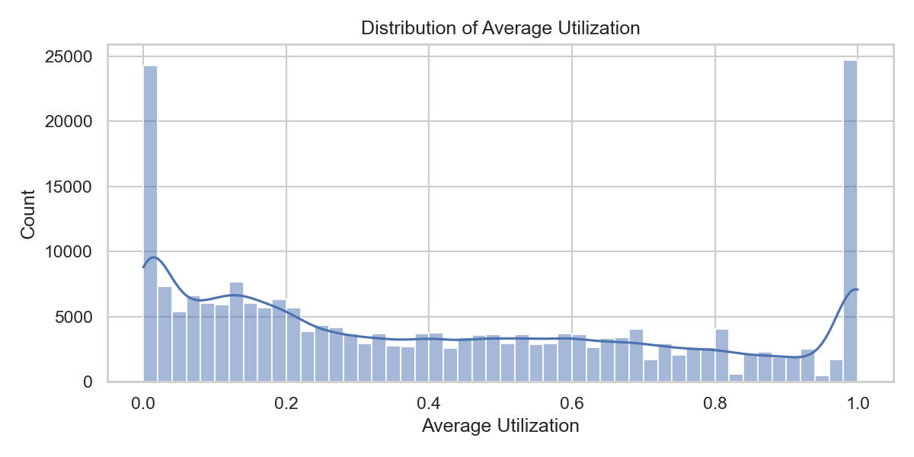
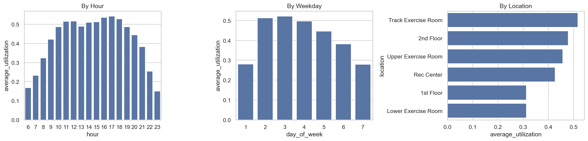
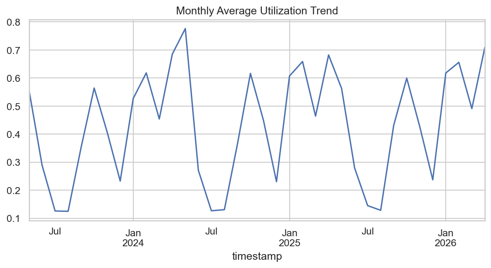
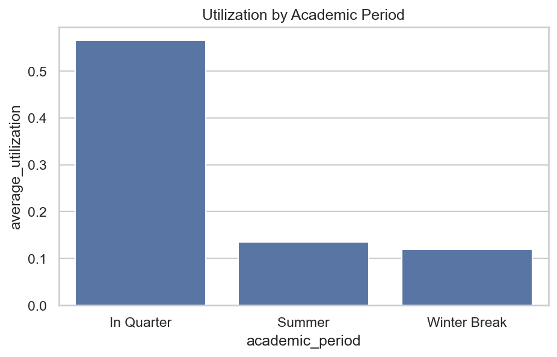
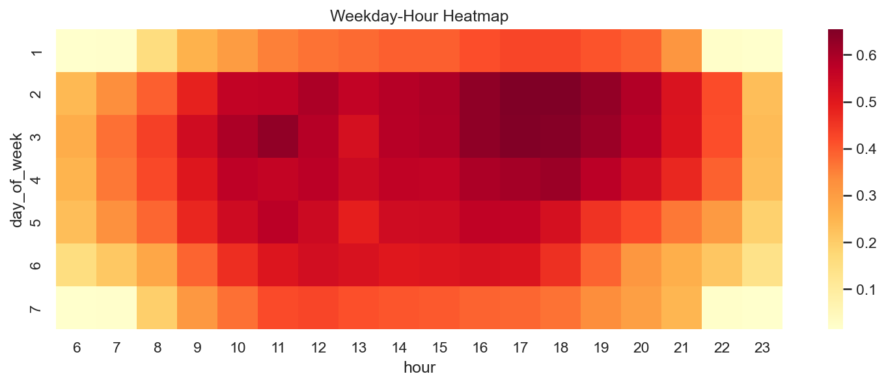
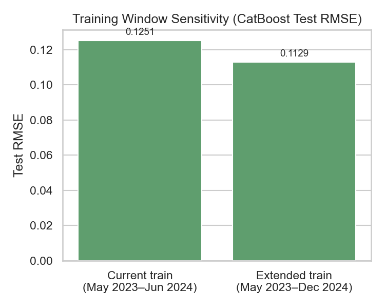
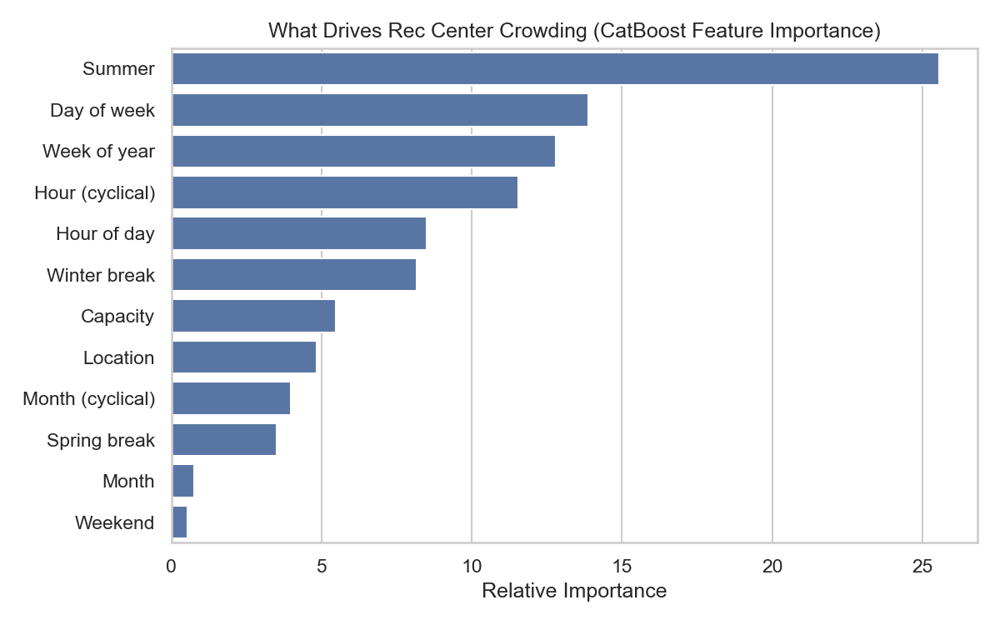
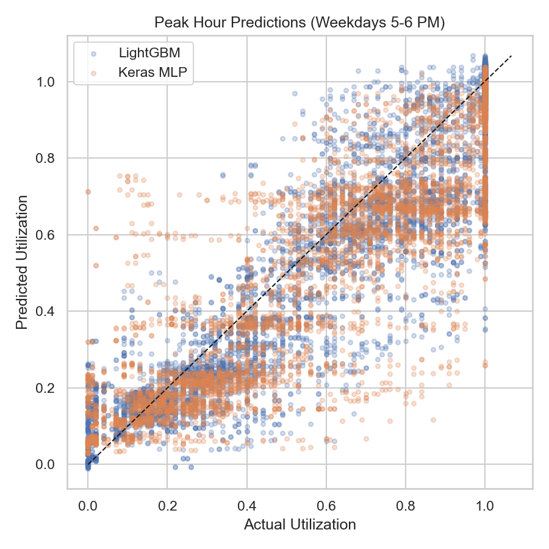
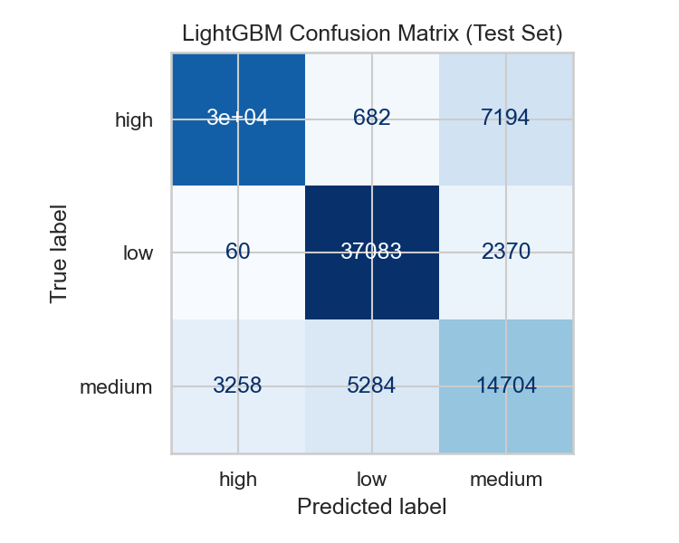

# Cal Poly Rec Center Usage Prediction — Final Report

**Advanced Machine Learning Final Project**

**GitHub repository:** [github.com/tyleroberts4/Advanced-Machine-Learning](https://github.com/tyleroberts4/Advanced-Machine-Learning) (see the `rec_center/` folder for notebooks, figures, and code)

---

## 1. Problem Statement

The Cal Poly Recreation Center is one of the most heavily used student facilities on campus, yet students often have no reliable way to know how crowded it will be before they arrive. Long lines, full weight rooms, and packed cardio areas create frustration and can discourage students from using a resource they already pay for.

This project addresses a practical question: **Can we predict how busy the Rec Center (and specific areas within it) will be at a given date and time?**

We built two complementary prediction tools:

1. **Regression model** — estimates exact utilization (occupancy relative to capacity, on a 0–1 scale).
2. **Classification model** — labels each time slot as **low**, **medium**, or **high** usage for easy student-facing recommendations.

These predictions can support student planning ("When is the best time to go?"), Rec Center staffing decisions, and future integration with a mobile app or website.

---

## 2. Data Description

### Source and coverage

The data comes from **Occuspace**, a occupancy-analytics platform that estimates how many people are in tracked spaces. We used Cal Poly Rec Center exports collected every **30 minutes** from **6:00 AM to 11:30 PM**, spanning **May 2023 through April 2026**.

After cleaning, the modeling dataset contains **223,283 observations** across **six locations**:

| Location | Role |
|---|---|
| Rec Center (overall) | Whole-facility crowding |
| 1st Floor | General floor traffic |
| 2nd Floor | General floor traffic |
| Lower Exercise Room | Strength/cardio area |
| Upper Exercise Room | Strength/cardio area |
| Track Exercise Room | Track and adjacent equipment |

### Key variables

- **Average Utilization** (primary target): average occupancy divided by listed capacity. A value of 0.50 means the space is about half full; 1.0 means at capacity.
- **Time predictors**: hour of day, day of week, month, weekend indicator.
- **Location**: which area of the Rec Center is being measured.
- **Capacity**: maximum listed occupancy for each space (used for context, not as a standalone predictor for utilization).

### Data quality notes

- No missing values in the original export columns.
- **216 duplicate** location/timestamp pairs were removed.
- **22,069 rows** had average utilization above 1.0 (Occuspace estimated more people than listed capacity). We retained these observations but **capped utilization at 1.0** for modeling, since values above 100% likely reflect sensor or capacity-listing error rather than a fundamentally different crowding pattern.

---

## 3. Exploratory Analysis

Our analysis of three years of usage data revealed clear, actionable patterns.

### Overall utilization

Average utilization across all locations and times is **0.44** (44% of capacity), with a median of **0.35**. The distribution is right-skewed: most intervals are moderately busy, but a meaningful share of periods are very crowded.

### Time-of-day patterns

Usage is lowest in the early morning and late evening. Crowding builds through the afternoon and peaks between **4:00 PM and 6:00 PM**, with **5:00 PM** showing the highest average utilization.

### Day-of-week patterns

**Monday and Tuesday** are the busiest days, followed by Wednesday. **Saturday and Sunday** are consistently quieter — roughly 15–20% lower average utilization than midweek days.

### Location differences

Not all areas are equally crowded. The **Track Exercise Room** averages **0.58** utilization, followed by the **2nd Floor** (0.52) and **Upper Exercise Room** (0.49). The **1st Floor** and **Lower Exercise Room** are the least crowded at roughly **0.31** each — useful alternatives when popular areas are full.

### Seasonal and academic calendar effects

Monthly trends show visible dips during **summer** and **winter break**, and higher usage during active academic quarters. August 2023 and summer months consistently show lower utilization, while May 2024 showed the highest monthly average — likely reflecting pre-finals and end-of-quarter activity.

### Weekday–hour interactions

A heatmap of weekday versus hour confirms that **weekday late afternoons** are the hottest windows, while **weekend mornings** and **late evenings** are consistently quieter. These interaction patterns motivated our use of flexible, nonlinear models rather than simple linear formulas.

---

## 4. Modeling Approach

### How we trained and tested

We treated this as a **forecasting problem**: the model learns from past usage and predicts future periods it has never seen. Data was split by time:

| Split | Calendar span | Approx. months | Observations | Purpose |
|---|---|---:|---:|---|
| Training | May 2023 – June 2024 | ~14 | 82,679 | Learn historical patterns |
| Validation | July – December 2024 | 6 | 39,596 | Tune and confirm model settings |
| Test | January 2025 – April 2026 | ~16 | 101,008 | Final unbiased evaluation |

We deliberately avoided random train/test splits, which would mix future data into training and overstate accuracy.

**Why is the test window longer than training?** The test period includes all data after validation through the end of our export (April 2026). Holding out a large block of future months gives a stable evaluation across two full academic years. The six-month validation window sits between train and test so hyperparameters are chosen on recent-but-not-future data.

**Would a longer training window help?** We ran a sensitivity check: retraining CatBoost on train + validation (May 2023 – December 2024) with the same tuned settings improved test RMSE from **0.125 to 0.113** (~1.2 percentage points). That is a meaningful but modest gain. We kept the shorter training window for the primary results because it preserves an independent validation set for tuning; in production, we would retrain on all available history after each tuning cycle.

### Features used

Beyond raw time and location fields, we engineered:

- **Weekend indicator** and **cyclical time encodings** (sin/cos transforms for hour and month)
- **Academic calendar flags**: summer, winter break, spring break, and finals week (derived from Cal Poly's academic calendar)

We excluded peak occupancy and peak utilization from predictors because they describe the same 30-minute window as the target and would inflate performance artificially.

### Models compared

**Regression (predict exact utilization):**

| Model | Description |
|---|---|
| Historical mean baseline | Average utilization by location × weekday × hour |
| Ridge regression | Linear model with regularization |
| Random Forest | Ensemble of decision trees |
| LightGBM / CatBoost | Gradient boosting (state-of-the-art for tabular data) |
| Keras MLP | Neural network with two hidden layers |
| Stacking ensemble | Combines LightGBM, CatBoost, and MLP via a meta-learner |

**Classification (predict low / medium / high):**

| Category | Threshold |
|---|---|
| Low | Utilization below 0.30 |
| Medium | 0.30 – 0.60 |
| High | Above 0.60 |

These cutoffs align with the data median (0.35) and mean (0.44), giving intuitive "quiet / moderate / crowded" labels.

Models compared: logistic regression, random forest, LightGBM, CatBoost, and a Keras neural network classifier.

### Hyperparameter tuning

Tree and linear models were tuned with **RandomizedSearchCV** (3-fold cross-validation on the training set, 10–12 random combinations per model). The neural networks used **Optuna** (12–15 trials over hidden-layer size, dropout, and learning rate). Validation-set performance confirmed the search winners; all models below were evaluated once on the held-out test period.

**How we searched for settings.** For regression, Ridge, Random Forest, LightGBM, and CatBoost each used **RandomizedSearchCV** with 3-fold cross-validation on the training set (10–12 random draws per model). Ridge tuned regularization strength (`alpha` from 0.001 to 100 on a log scale). Random Forest tuned tree count, depth, and minimum leaf size. LightGBM tuned number of trees, learning rate, leaf count, and row subsampling. CatBoost tuned tree depth, learning rate, iteration count, and L2 regularization. The Keras neural network used **Optuna** for 12 trials over two hidden-layer sizes, dropout, and learning rate. The stacking ensemble used a fixed Ridge meta-learner (`alpha = 1.0`) fit on validation predictions from the three base models. Classification models followed the same RandomizedSearchCV approach (8–10 iterations per model) but were scored by **macro-F1** instead of RMSE.

**Table B — Selected hyperparameters (final models)**

| Model | Final settings |
|---|---|
| Ridge | `alpha` = 54.6 |
| Random Forest | `n_estimators` = 300, `min_samples_leaf` = 5, `max_depth` = unlimited |
| LightGBM | `n_estimators` = 600, `learning_rate` = 0.05, `num_leaves` = 63, `subsample` = 0.9 |
| CatBoost | `depth` = 10, `learning_rate` = 0.05, `iterations` = 500, `l2_leaf_reg` = 5 |
| Keras MLP (regression) | 128 → 16 units, `dropout` = 0.29, `learning_rate` = 0.0045 |
| Stacking ensemble | Meta weights: LightGBM 0.21, CatBoost 0.78, MLP 0.05 |
| CatBoost (classification) | `depth` = 8, `learning_rate` = 0.1, `iterations` = 500 |

---

## 5. Results and Model Comparison

### Regression results (test set)

| Model | RMSE | MAE | R² |
|---|---:|---:|---:|
| **Stacking ensemble** | **0.123** | **0.089** | **0.872** |
| CatBoost | 0.125 | 0.088 | 0.867 |
| LightGBM | 0.128 | 0.088 | 0.862 |
| Random Forest | 0.134 | 0.090 | 0.848 |
| Keras MLP (neural network) | 0.143 | 0.100 | 0.826 |
| Ridge regression | 0.219 | 0.175 | 0.593 |
| Historical mean baseline | 0.289 | 0.247 | 0.291 |

**How to read these metrics:**

- **RMSE (root mean squared error)** — our primary metric. It penalizes large misses heavily, which matters most during peak hours when students care most about accuracy. An RMSE of 0.123 means typical prediction errors are roughly 12 percentage points of utilization.
- **MAE (mean absolute error)** — easier to interpret: on average, predictions are off by about **9 percentage points** for the best models.
- **R²** — share of variance explained. Our best model explains about **87%** of utilization variation on unseen future data.

On the validation set (July–December 2024), CatBoost reached RMSE **0.130** and LightGBM **0.132**, closely matching test performance — a sign that tuning generalized rather than overfitting to a single split.

### What drives crowding?

Beyond overall accuracy, we asked which inputs the best tree model (CatBoost) relies on most. The chart below aggregates one-hot location columns into a single **Location** bar.

**Takeaways:**

- **Time and calendar context dominate.** Day of week, week of year, and hour-related features (raw hour plus cyclical encodings) are among the strongest predictors — consistent with EDA showing weekday 4–6 PM peaks.
- **Academic calendar flags matter.** Summer, winter break, and related flags rank highly; a separate ablation (below) confirms that adding calendar features materially improves accuracy.
- **Location still matters.** Which area of the Rec Center is being measured is a meaningful driver, even after accounting for time — aligning with the Track Room and 2nd Floor running much busier than the 1st Floor.
- **Capacity plays a supporting role.** Listed room capacity adds context but is less important than when and where the reading occurs.

### Neural network vs. non-neural network

Tree-based models (LightGBM, CatBoost, Random Forest) outperformed the neural network on this dataset. This is a common finding for structured tabular data with strong categorical interactions (location × hour × weekday). The neural network still beat linear baselines by a wide margin but did not justify its added complexity over gradient boosting alone.

The stacking ensemble achieved a modest improvement over the best individual model (RMSE 0.123 vs. 0.125 for CatBoost alone), suggesting some benefit from combining diverse model types, though the gain is small relative to the engineering effort.

### Classification results (test set)

| Model | Accuracy | Macro-F1 |
|---|---:|---:|
| **CatBoost** | **81.9%** | **0.793** |
| LightGBM | 81.3% | 0.787 |
| Random Forest | 81.3% | 0.784 |
| Keras MLP | 80.4% | 0.779 |
| Logistic regression | 70.9% | 0.658 |

**Macro-F1** is our primary classification metric because it weights low, medium, and high usage classes equally — important since high-crowd periods are less frequent but most valuable to predict correctly.

CatBoost correctly classifies usage level about **82%** of the time on held-out future data, with strong performance across all three categories.

### Feature impact: academic calendar (ablation)

As complementary evidence to the global importance chart, we trained LightGBM with and without academic calendar flags. Adding summer, breaks, and finals indicators improved test RMSE from **0.145 to 0.128** — confirming that campus schedule effects are real and worth modeling even when hour and location already explain most variation.

---

## 6. Conclusions and Recommendations

### Key findings

1. **Rec Center usage is highly predictable** from time, location, and calendar context. Our best model achieves ~9-point average error on a 0–1 scale for future time periods.
2. **Peak crowding is concentrated** on weekday afternoons (4–6 PM), especially Monday through Wednesday.
3. **Location matters significantly.** The Track Exercise Room and 2nd Floor run 60–80% higher utilization than the 1st Floor and Lower Exercise Room.
4. **Summer and breaks are reliably quieter**, making them good times for students who prefer less crowded workouts.
5. **Gradient boosting models are the practical choice** for deployment; neural networks and ensembles offer diminishing returns on this dataset.

### Recommendations for Rec Center staff and students

**For students:**
- Visit **early morning (before 10 AM)** or **weekends** for the lowest crowding.
- Avoid **Monday–Wednesday, 4:00–6:00 PM** if possible.
- If the Track Room or 2nd Floor is full, try the **Lower Exercise Room or 1st Floor** — they average roughly half the utilization.

**For Rec Center operations:**
- Use predicted peak windows to **align staffing and equipment availability** with expected demand.
- Publish a simple **low / medium / high forecast** by location and hour — the classification model supports this directly.
- Consider integrating predictions into the **Rec Center app or website** as a "busyness forecast" feature.

### Limitations

- Occuspace estimates are not exact headcounts; utilization above 100% suggests capacity list mismatches or sensor noise.
- The model reflects historical patterns and may not immediately capture sudden changes (new equipment, policy changes, or major campus events).
- Predictions are most reliable for **regular recurring patterns**; one-off events are not captured.

### Next steps

- Deploy a weekly-updated forecast dashboard by location and hour.
- Add real-time Occuspace API integration for live + predicted views.
- Re-train annually to incorporate new academic calendar years and facility changes.

---

*This report accompanies the full reproducible analysis in the [Rec Center GitHub repository](https://github.com/tyleroberts4/Advanced-Machine-Learning/tree/main/rec_center) ([README](../README.md)).*
